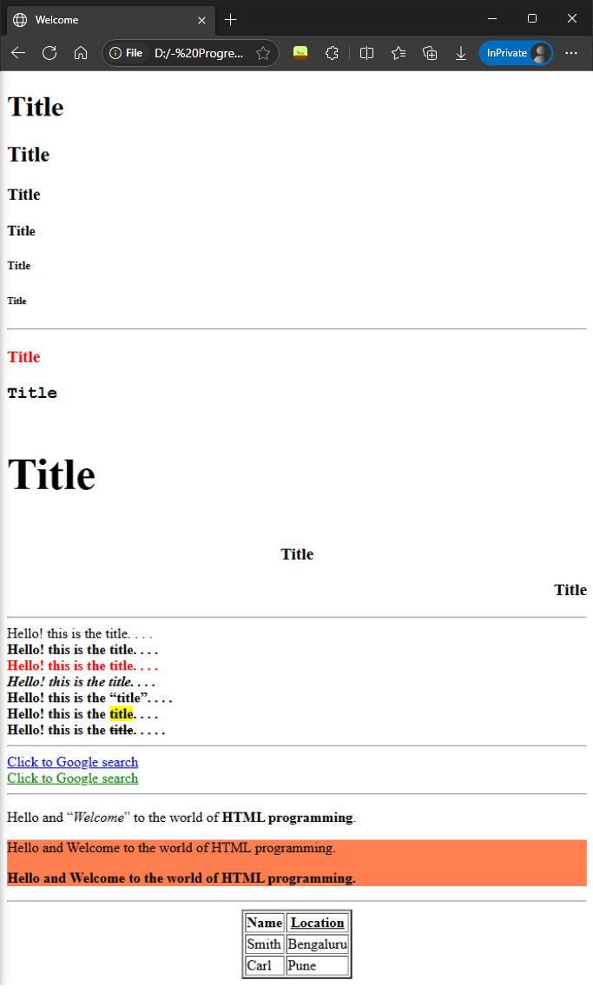

> 🔋BATTERY : 🟢⚪⚪⚪⚪⚪⚪⚪  

Lecture1 :

<h2 align="center">HTML & Inline CSS</h2>


In this section we will going to build 'Web app' instead of 'Website', and for this we use frontend technologies like HTML, CSS and JavaScript.  

And the difference between 'website' and 'web app' is that : a 'website' can't manipulate data or it just used to display contents only e.g. college website, whereas 'Web app' can able to manipulate data e.g. Facebook which suggest friends to us, Google search engine helps to search data, Youtube, Tax calculator, etc. So, Front-end technologies (i.e. browser side programmings) are also known also Client side programming/code. 

- HTML, CSS, and JavaScript codes directly executes/runs in any modern browser engine, so it doesn't required any extra IDE tool & compiler as like we use for Java codes execution.  

- HTML, CSS, and JavaScript codes are used to create GUI (Graphical User Interface) purpose in a web application.

- HTML code gives the basic skeleton structure to a web app GUI page.

- CSS code used for designing & styling the HTML structure for presentation.

- JavaScript code used to add restrictions & validations (for user data inputs) limiations in GUI page. For example like : "Amount entered in the input-box (field) shouldn't be greater than 200", and if we enter the amount greater than 200 then the browser won't accept the value or amount. 

- HTML codes have pre-defined HTML tags, so we need to remember these tags names and then we can able to use accordingly to our needs. Basically we have to understand this, and after that we can simply do cut-copy-paste editing work.  

The following is the basic structure/hierarchy/architecture/template of a HTML page :
```html
<!DOCTYPE html>
<html>
    <head>
        <title>Welcome</title>
    </head>
    <body>


    </body>
</html>
```


<br>
---
<br>


Now let's see some examples : 
```html
<!DOCTYPE html>
<html>
<head>
     <!-- tab's tittle -->
    <title>Welcome</title>
</head>
<body>
    <!-- Page Headers/Title -->
    <h1>Title</h2>
    <h2>Title</h2>
    <h3>Title</h3>
    <h4>Title</h4>
    <h5>Title</h5>
    <h6>Title</h6>


    <hr> <!-- a ruler to segregate web page sections -->


    <!-- Page headers with color -->
    <h3 style="color: red;">Title</h3>

    <!-- Page header with font family or font type -->
    <h3 style="font-family: Courier New;">Title</h3>

    <!-- Page header with font size -->
    <h3 style="font-size: 50px;">Title</h3>

    <!-- Page header with font alignment or text alignment -->
    <h3 style="text-align: center;">Title</h3>
    <h3 style="text-align: right;">Title</h3>


    <hr>


    <!-- writing simple text --><!-- But for best practice use <p></p> tag -->
    Hello! this is the title. . . .
    <br> <!-- to segregate text in new line -->

    <!-- Text with bold format -->
    <b>Hello! this is the title. . . .</b>
    <br>

    <!-- Text formats with : bold & color -->
    <b style="color: red;">Hello! this is the title. . . .</b>
    <br>
    
    <!-- Text formats with : bold & italics -->
    <b><i>Hello! this is the title. . . .</i></b>
    <br>

    <!-- Text format with quotation mark -->
    <b>Hello! this is the <q>title</q>. . . .</b>
    <br>

    <!-- Text format with highlight marking text -->
    <b>Hello! this is the <mark>title</mark>. . . .</b>
    <br>

    <!-- Text with strike off : used to show sometime discount itmes -->
    <b>Hello! this is the <del>title</del>. . . . .</b>


    <hr>


    <!-- Hyperlink text -->
    <a href="https://www.google.com/">Click to Google search</a>
    <br>

    <!-- Hyperlink text with color -->
    <a href="https://www.google.com/" style="color: green;">Click to Google search</a>
    <br>


    <hr>


    <!-- paragraph writing --><!-- best practice -->
    <p>Hello and <q><i>Welcome</i></q> to the world of <b>HTML programming</b>.</p>

    <!-- Grouping of tags -->
    <div style="background-color: coral;">
        <!-- here paragraph1 and paraagraph2 are under one division/group/section -->
        <p>Hello and Welcome to the world of HTML programming.</p>
        <p><b>Hello and Welcome to the world of HTML programming.</b></p>
    </div>


    <hr>


    <!-- Table making -->
    <table border="2" align="center">
        <tr><!-- table-row -->
            <th>Name</th><!-- table-header-->
            <th><u>Location</u></th>
        </tr>

        <tr>
            <td>Smith</td><!-- table-data -->
            <td>Bengaluru</td>
        </tr>
        <tr>
            <td>Carl</td>
            <td>Pune</td>
        </tr>
    </table>

</body>
</html>
```

Result or the output of the above HTML code looks like :



- `<h1></h1>` tag is used for page header, and similarly there are upto `<h6></h6>` tags.
- There are 3 popular ways/techniques/methods to use CSS code out of many others, i.e. :
    - [x] 'Inline CSS' code with HTML code (uses `style=""` attribute),
    - [x] 'Internal (Embedded) CSS' code with HTML code (uses `<style></style>` tag), and
    - [x] 'External CSS' code in seperate .css file.  

- So, now we start with using the 'Inline CSS' method, in which `style=""` attribute integrate CSS style in a basic way. But later we will also explore the other 2 techniques to use CSS code also. 

- In HTML code we do commenting like `<!-- comment -->`, and this same comment syntax we used to comment in XML file as well as HTML file also. Commenting in any code helps to classify the codes easily, so that if other programmers looks our code it gives them readability. And brower engine neglects to execute Comment, it just used for educating other people.

- So, here we don't need to confuse between html's 'tags' and html's 'attributes'. For example : `<u></u>` or `<b></b>` are html's 'underline' & 'bold' tags, and `style=""` and `href=""` are html's CSS & hyperlink attribute. And similarly there are lots of tags and attributes.

- Here, 'attributes' are the properties/features of 'tags', and 'tags' are the format of the html text.

- For paragraph writing we use `<p></p>` tag instead of directly writing without any tag.

- Sometime we want all the paragraphs to be present in one place or to be in one section/group, then for this we use `<div></div>` tag and inside it we can put some paragraphs which will be in the same group. So, `<div></div>` tag use for grouping of tags, like Group1 division or Group2 division etc. So, that if we put any style to this group then we can see effects in its each element, and we doesn't need to apply style effect individually to each element or paragraph here.

- So, we can say that `<div></div>` tag helps us to group all fields in one block, and that if we make any changes to root-tag (i.e. `<div></div>` tag) then rest of the tags will effect accordingly e.g. as we set background color in the above code.

- If we want to make Table or add Table, then we have to know that a Table consist of : head/table-header, rows, columns and data. And to make Table we use `<table></table>` tag as parent-tag, and inside this tag we include : `<th></th>` table-header, `<tr></tr>` table-row, `<td></td>` table-data accordingly. And the sequence to use these tags we can see in the above code.


---
---
Lecture2 :


---  


