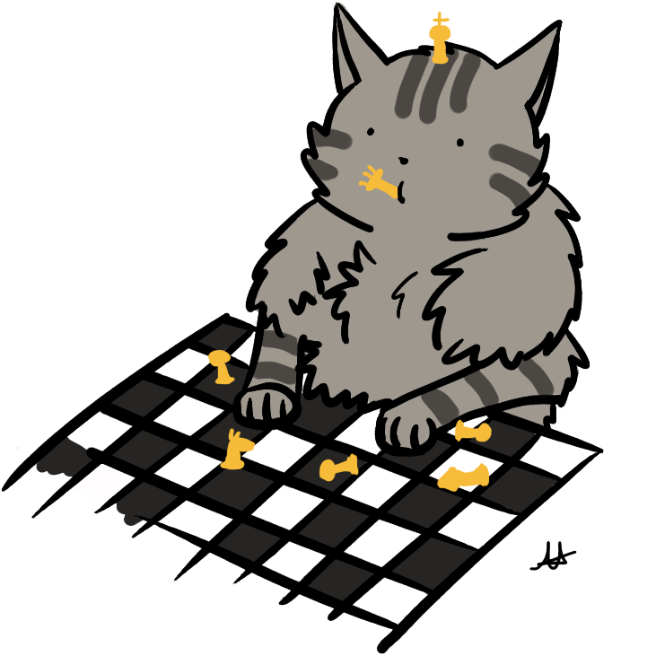

# demo1-repo
This repository is just for demo to know the functions and usages of GitHub only.

----

**Can start making notes here :**  
- [ ] Java DSA
- [ ] Microservices
- [ ] HTML, CSS, JS
- [ ] ...any To-Do-List
- [ ] own document assets
- [ ] can use here Marmaid diagrams also. . .
- [ ] can able to make notes by using diagrams also. . .

 
====

for example to add an image here is :  
• first upload the image to this repository,  
• then use its link here like :  
e.g.  
  

or 

